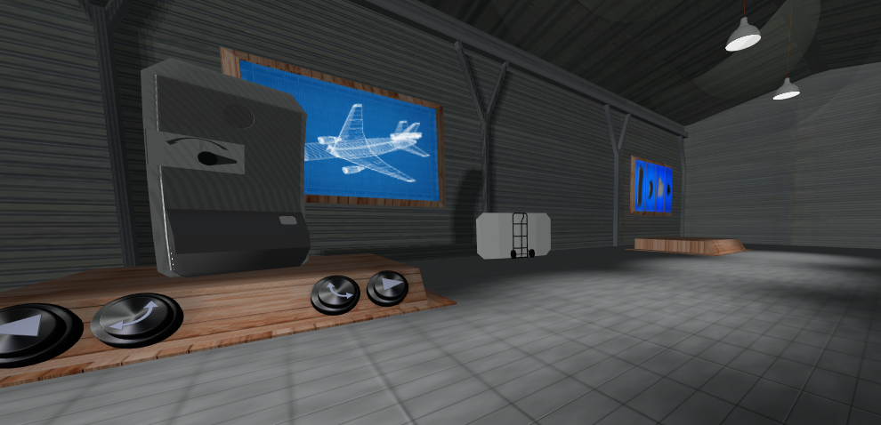
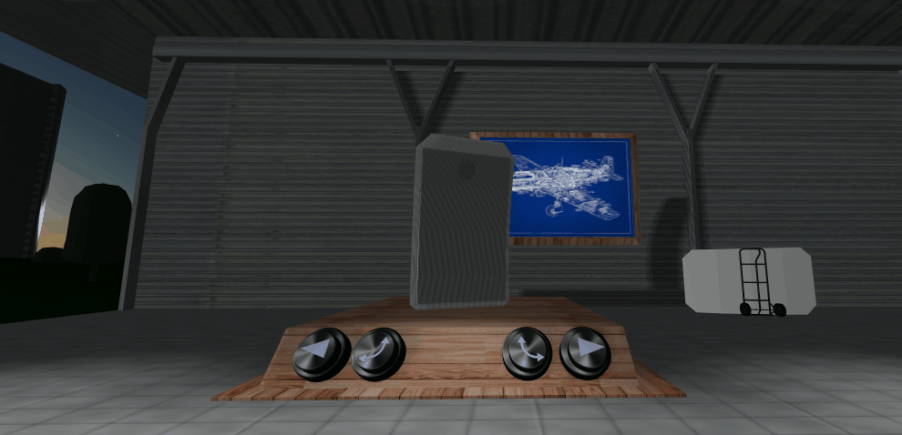
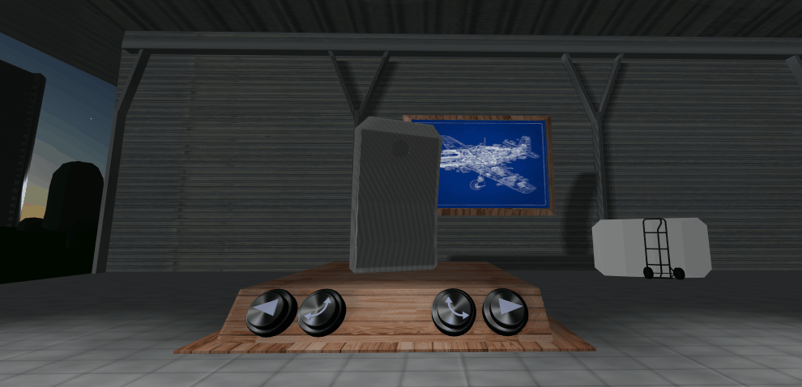
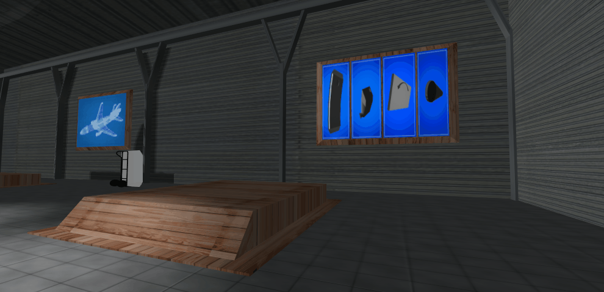

# Lab3 - 3º BD
Professor da Disciplina: Giuliano Bertoti 

Equipe:
 - Jonathas H. Moraes - RA: 1460481811044

Projeto para desenvolvimento de um ambiente em realidade virtual que pode substituir manuais de montagem de peças de uma aeronave, podendo virar livremente as peças.

Movimentação da peça na plataforma:

Montagem das peças na ordem correta, com botões para prosseguir os passos da montagem:

Montagem com ordem e feedback quando escolhido errado:

Para um preview do projeto para interação, clique abaixo:

Projeto de Backend:

